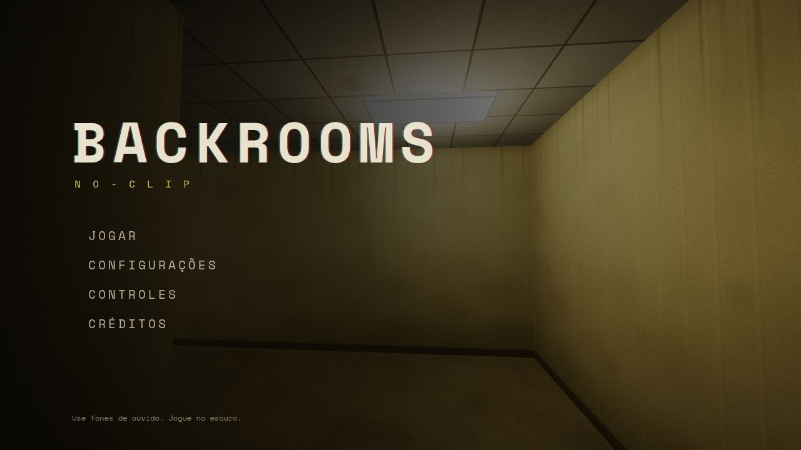
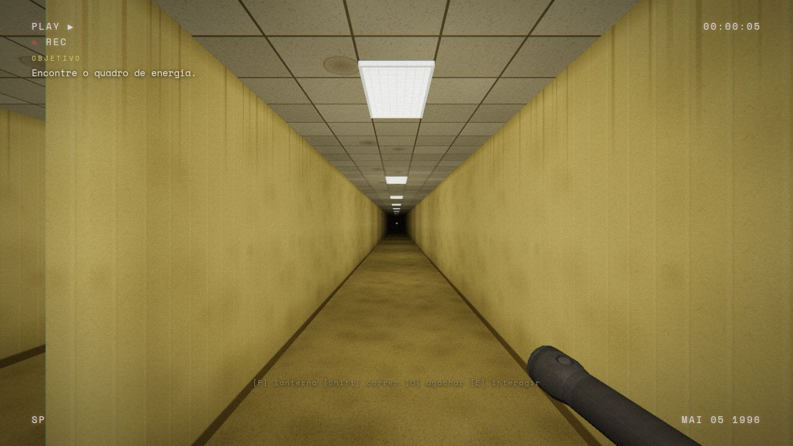
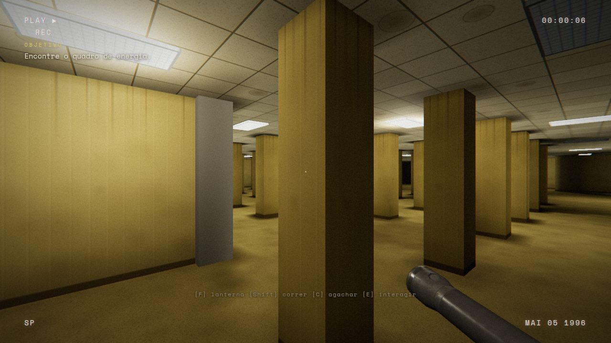
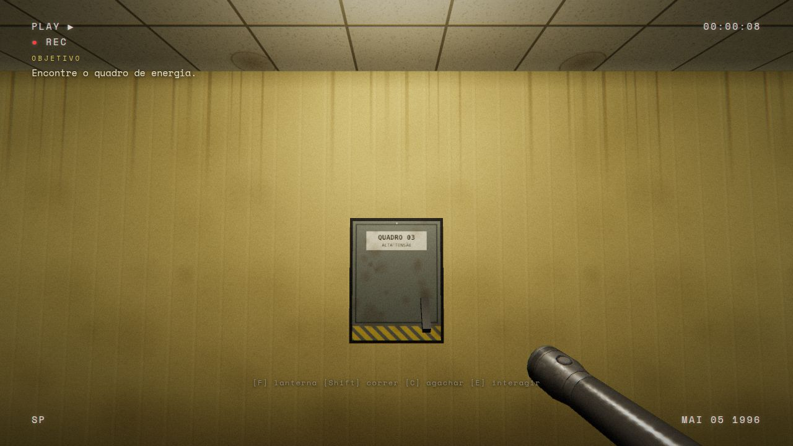
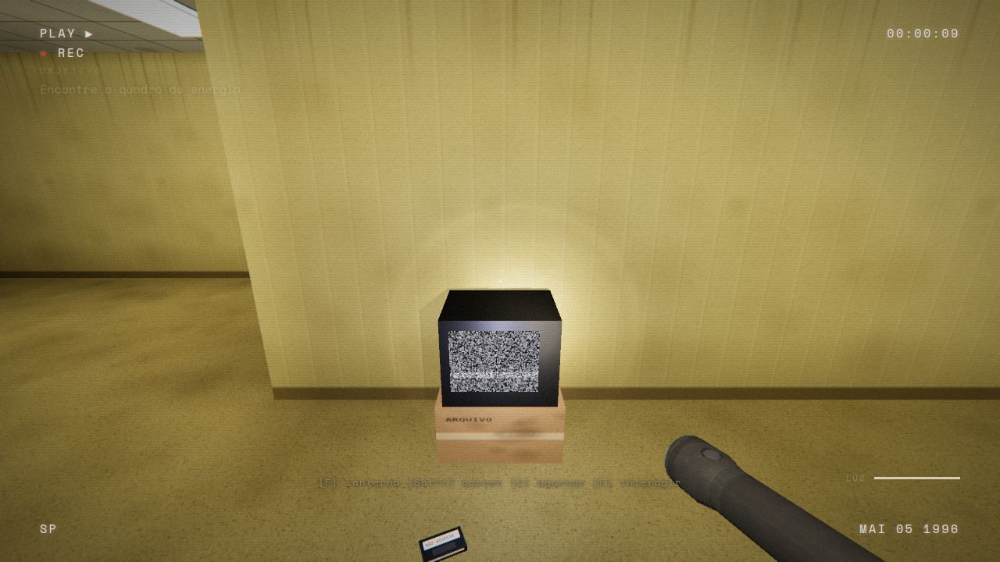
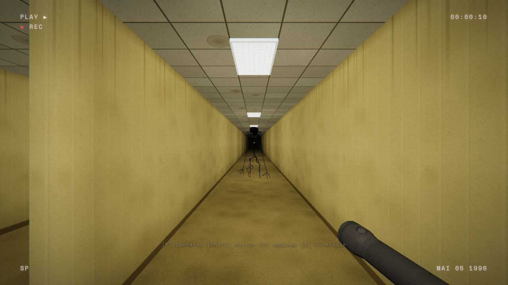
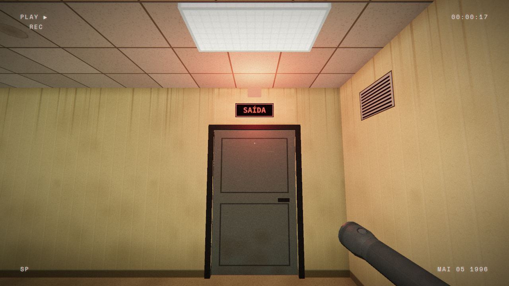

# BACKROOMS: NO-CLIP

A short first-person horror game set in the Backrooms, running in the browser with
Three.js and the Web Audio API. Every run is a new procedurally generated maze of
yellow wallpaper, wet carpet and buzzing fluorescent lights — and something else
that wakes up when you start turning the power back on.



| | |
|---|---|
|  |  |
|  |  |
|  |  |

## The game

You wake up on the carpet with no memory of getting there. There is no map and no
tutorial beyond a line of text in the corner of the screen:

1. **Restore the power** — find the electrical panel and hold `E` to flip it back on.
   The dark sectors flicker back to life… and something screams in the distance.
2. **Find the tape** — follow the TV static to a VHS tape. It shows a metal door
   under a red light. Parts of the map lose power for good.
3. **Force the exit** — find the door under the red light and hold `E`. An alarm goes
   off and the door takes 25 seconds to open. *It heard that.* Survive, then walk
   into the light.

A first run takes roughly 15–30 minutes. Dying lets you rewind to the last completed
objective (or restart the whole tape). Each run has a seed: the end screens show it
and you can type one in the settings to replay a specific map.

### Controls

| Key | Action |
|---|---|
| `W` `A` `S` `D` | move |
| Mouse | look |
| `Shift` | run (uses breath, loud) |
| `C` | crouch (slow, nearly silent) |
| `F` | flashlight (battery; pick up batteries on the floor) |
| `E` | interact (hold when asked) |
| `Tab` | show current objective |
| `Esc` | pause |

Headphones strongly recommended: sounds are positioned in 3D and the creature is
mostly something you *hear* before you see it.

## Requirements

- Desktop browser with WebGL 2 and hardware acceleration (recent Chrome, Edge or
  Firefox). Keyboard and mouse. Mobile/touch devices get a notice instead of a
  broken UI.
- Development: Node.js 20+ (tested with Node 24).

## Running

```bash
npm install
npm run dev       # dev server at http://localhost:5173
npm run build     # static build in dist/
npm run preview   # serve the production build locally
npm test          # unit tests (node:test, no extra dependencies)
```

`dist/` is a plain static site with relative paths: it can be published as-is on
GitHub Pages (including project sub-paths), Netlify, Vercel or any static server.
Opening `index.html` straight from the file system is not supported (browsers block
ES modules and asset fetches on `file://`); use `npm run dev` or `npm run preview`.

## Settings

Master / effects / ambience volume, mouse sensitivity, field of view, quality
(Auto, Low, Medium, High), fullscreen, reduce camera motion, subtitles for
important sounds, and an optional seed. Settings, best time and completion are
stored in `localStorage`.

Quality presets control pixel ratio, flashlight shadows, the number of real
lights near the player, post-processing (VHS pass, bloom, MSAA) and draw distance.
*Auto* picks a preset from the GPU and screen, and steps down once if frames are
consistently slow.

## Architecture

```
index.html, styles/main.css        menus, HUD, VHS overlay (DOM)
scripts/main.js                    boot, state machine, fixed-timestep loop, settings
scripts/core/                      rng (seeded), settings (storage), assets (preload), log
scripts/game/                      pure logic, no Three.js — unit tested
  grid.js        cell grid, walls on edges, coordinate helpers
  procgen.js     zones, maze, rooms, pillar halls, corridors, landmarks, validation
  placement.js   world transforms of props/objectives (shared by render + collision)
  collision.js   circle vs AABB with sub-steps, occupancy raster for line of sight
  pathfinding.js BFS paths and distance fields
  lightfield.js  baked lamp irradiance with wall occlusion
  player.js      movement with acceleration, crouch, footsteps/noise
  stamina.js     sprint stamina with exhaustion hysteresis
  monster.js     creature perception (sight + hearing) and state machine
  director.js    tension, pacing, event and appearance scheduling
  spots.js       fair placement queries (out of view, far enough)
  objectives.js  the three-step progression and the escape
scripts/systems/                   Three.js / Web Audio / DOM
  session.js     one run: wires map, world, creature, director, objectives; dispose()
  world.js       merged chunk geometry, instanced props and lamps, set pieces
  lampShader.js  shader patch that adds the baked lamp field + macro variation
  textures.js    procedural canvas textures (wallpaper, carpet, tiles, decals…)
  view.js        camera feel (bob, sway, shake) and the flashlight
  monsterView.js creature model with procedural animation
  audio.js       buses, ambience layers, spatial one-shots, synthesis
  effects.js     post-processing (bloom, tone mapping, VHS pass)
  quality.js     presets and automatic selection
  input.js       keyboard, mouse, pointer lock
  ui.js          screens, settings form, HUD
  debug.js       development-only overlay and QA hooks
tests/                             node:test suites for scripts/game and settings
tools/qa.mjs                       automated browser QA over the Chrome DevTools Protocol
tools/optimize-glb.mjs             how the shipped flashlight model was optimised
```

Key decisions:

- **Game states** are explicit (`LOADING → MENU → INTRO → PLAYING ⇄ PAUSED → DEAD/WIN`).
  A run is a `Session` object that owns everything it creates and tears it down in
  `dispose()`; page-level listeners are registered once.
- **Fixed 60 Hz simulation** with interpolated rendering. Frame delta is clamped
  (tab switches, hitches) and the simulation never runs while paused, hidden or
  without pointer lock.
- **Lighting**: hundreds of ceiling lamps are baked into a 2D irradiance texture
  (with wall occlusion) sampled by every surface, instead of hundreds of real lights.
  A small pool of real lights follows the *flickering* fixtures near the player,
  the flashlight is a cookie-textured spot light with shadows.
- **Geometry**: floors, ceilings and walls are merged per 12×12-cell chunk;
  lamps and props are instanced. A typical frame is ~40–60 draw calls including
  the shadow and post-processing passes.
- **Safe procedural generation**: every map is validated after generation (full
  connectivity, objectives/exit/batteries reachable, nothing inside walls, minimum
  distances, creature spawn out of sight). Invalid maps are regenerated with a
  bounded number of retries.
- **Creature AI**: states `DORMANT, IDLE, PATROL, INVESTIGATE, SEARCH, STALK, CROSS,
  ALERT, CHASE, COOLDOWN, ATTACK`. It perceives the player only through sight
  (distance, view cone, line of sight, how lit the player is, flashlight, crouch)
  and sound (footsteps, interactions, attenuated by walls, with positional error).
  It searches the last known position, then backs off. Threat scales with progress:
  early it only appears, watches and vanishes; it hunts for real after the tape.
- **Fairness rules**: no perception during the first 75 s; the creature is only
  relocated when the player cannot see the destination and it is far away; chase
  speed is below sprint speed, a short alert precedes every chase, catching requires
  line of sight, and a relief window follows every chase.
- **Director**: keeps a tension value (progress, proximity, chase, darkness, recent
  events) that drives drones, heartbeat, breathing and post effects, and schedules
  rare events with global gaps, per-event cooldowns and stage gating.

### Debug mode (development only)

With `npm run dev`, press `F3` (or open `/?debug`) for an overlay with FPS, draw
calls, seed, player and creature state, the creature's path, tension and director
timers. `F4` jumps to the current objective, `F6` toggles god mode, `F7` puts the
creature nearby, `F8` toggles an autopilot that walks to the objectives through
the real collision. None of this is included in production builds.

### Automated QA

`tools/qa.mjs` drives the dev build in headless Chrome (real GPU via ANGLE/EGL) or
Firefox (WebDriver BiDi) and writes JSON reports and screenshots to `.qa/`:

```bash
# A "frozen" dev server (no HMR/watch) so editing code never reloads a running test.
QA_NO_HMR=1 npx vite --port 5174 &
export QA_URL=http://localhost:5174/

node tools/qa.mjs smoke                 # boot, play, pause, render stats
node tools/qa.mjs playthrough s1 s2 s3  # autopilot completes full runs on seeds
node tools/qa.mjs restart 12            # restart stress (memory, GPU objects, DOM)
node tools/qa.mjs longrun 10 [stage]    # minutes of play with sampling
node tools/qa.mjs edge                  # pause freezes, blur pause, death, quality switches
node tools/qa.mjs checkpoint            # death -> resume from the last objective
node tools/qa.mjs assetfail             # every model/sample blocked: fallbacks
node tools/qa.mjs firefox               # Firefox smoke test
node tools/qa.mjs readme                # regenerate docs/screenshots
```

Run one scenario at a time: each one starts a GPU-accelerated browser.

## Assets and licenses

| Asset | Source | License |
|---|---|---|
| Creature model `bacteria_lifeform_backrooms.glb` | "Bacteria Lifeform (Backrooms)" by [VHSvince](https://sketchfab.com/VHSvince), [Sketchfab](https://sketchfab.com/3d-models/bacteria-lifeform-backrooms-0d481d63f87d40e9bbcab60902ddf10a) | [CC BY 4.0](https://creativecommons.org/licenses/by/4.0/) |
| Flashlight model `old_flashlight.glb` | "Old Flashlight" by [Blender3D](https://sketchfab.com/Blender3D), [Sketchfab](https://sketchfab.com/3d-models/old-flashlight-576daeaa281840cfb3ece4850cc42469) — textures downscaled, transmission removed | [CC BY 4.0](https://creativecommons.org/licenses/by/4.0/) |
| `assets/source/original_backrooms.glb` (not shipped) | "Original Backrooms" by [Huuxloc](https://sketchfab.com/rjh41), Sketchfab | CC BY 4.0 |
| `footstep.ogg`, `flashlight_click.ogg`, `monster_scream.ogg` | Present in the original repository; origin not documented | **Unverified** — replace with CC0 recordings if in doubt (the game falls back to synthesized sounds if they are removed) |
| Textures, ambience, hum, drones, knocks, breathing, heartbeat, alarms | Generated procedurally at runtime by this project | Project license |
| Space Mono font | [@fontsource/space-mono](https://fontsource.org/fonts/space-mono) | SIL OFL 1.1 |
| three.js | [threejs.org](https://threejs.org) | MIT |

CC BY attributions are also shown in-game under *Créditos*.
